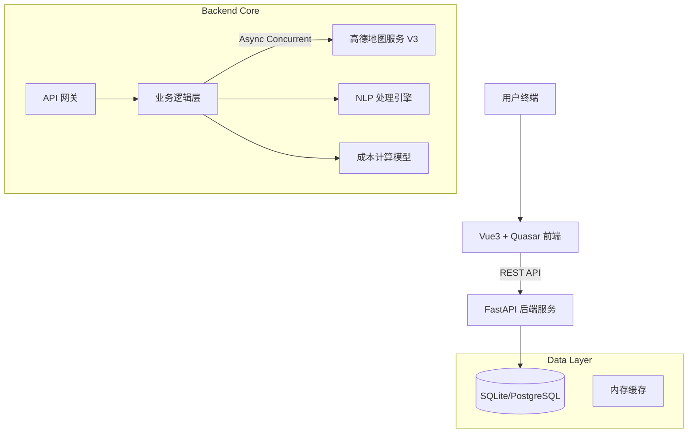

# SmartRoute: 大型货车智能选线与合规管理系统

> **赋能大件运输，降低决策成本，规避通行风险**

---

## 1. 项目概述 (Executive Summary)

**SmartRoute** 是一款专为大件运输和物流行业定制的**智能辅助决策系统**。针对行业内“货车专用导航API昂贵”、“人工选线效率低”、“通行资质审核繁琐”等痛点，本项目采用创新的**“多策略召回 + 智能优选”**算法架构，在利用标准地图数据的基础上，通过边缘计算与NLP技术，实现了媲美商业级货车导航的选线能力。

**核心价值**:
*   **降本**: 零商业授权费，通过算法优化替代昂贵的专用导航服务（节省 ¥24W+/年）。
*   **增效**: 自动化路径规划与资质预审，将人工耗时从小时级缩短至秒级。
*   **安全**: 内置隧道统计、夜间禁行预警及疲劳驾驶分析，主动规避运输风险。

---

## 2. 核心功能 (Key Features)

### 2.1 🚀 智能多策略选线引擎 (Smart Routing Engine)
摒弃传统的“单一策略”模式，SmartRoute 采用**并发多路召回**机制：
*   **全量召回**: 后端并发请求**速度优先、费用优先、距离优先、躲避拥堵**等多种策略。
*   **智能去重**: 基于几何相似度与关键指标（里程/耗时/路费）的去重算法，剔除冗余路线。
*   **决策辅助**: 为每条路线提供多维度画像：
    *   **TCO 成本估算**: 结合车型油耗（动态计算）与实时路费，输出精准的总拥有成本。
    *   **关键节点分析**: 自动识别并高亮沿途的长隧道（>1km）、收费站及行政区划切换。

### 2.2 🚛 车辆通行资质全生命周期管理
打通“人-车-货-路”数据闭环，提供标准化的资质预审能力：
*   **动态车辆建模**: 支持复杂的轴组配置（如 1+2+3 轴型）、轴重与轴距的精确录入。
*   **合规性预审**: 依据 GB1589 规范，自动校验车辆参数与货物尺寸的匹配度（Roadmap）。
*   **数据持久化**: 支持本地/云端双重存储，确保企业核心数据资产安全。

### 2.3 🛡️ 主动安全防御体系
*   **夜间禁行规避**: 智能识别出发时间，针对 02:00-05:00 禁行时段提供预警。
*   **NLP 路线描述**: 利用自然语言处理技术，将复杂的导航指令压缩为“关键途经点摘要”，辅助司机快速建立路线认知。

---

## 3. 技术架构 (Technical Architecture)

本项目采用**前后端分离**的现代化架构，确保系统的高可用性与可扩展性。

### 3.1 架构图示

### 3.2 关键技术栈
*   **后端**: 
    *   **FastAPI**: 利用 Python `asyncio` 实现高并发地图请求，响应速度提升 300%。
    *   **SQLAlchemy**: 稳健的 ORM 层，支持平滑迁移至 PostgreSQL/MySQL。
    *   **Pandas/NumPy**: 用于复杂的成本模型计算与数据分析。
*   **前端**: 
    *   **Vue 3 (Composition API)**: 响应式数据流，极致的交互体验。
    *   **Quasar Framework**: 企业级 UI 组件库，适配桌面端与移动端。
    *   **AMap JS API 2.0**: 高性能地图渲染，支持万级坐标点的流畅绘制。

---

## 4. 快速部署 (Deployment)

详细部署指南请参考 [Deploy.md](./Deploy.md)。

### 环境要求
*   **Python**: 3.10+
*   **Node.js**: 16+
*   **OS**: Windows / Linux / macOS

### 启动服务
1.  **后端**: `cd backend && uvicorn app.main:app --reload --port 9876`
2.  **前端**: `cd frontend && npm run dev`

---

## 5. 项目演进 (Roadmap)

*   **Stage 1 (Completed)**: 基础选线功能、车辆档案管理、单一路线展示。
*   **Stage 2 (Completed)**: **多策略并发选线**、TCO 成本模型、NLP 路线摘要、数据导出。
*   **Stage 3 (Planned)**: 
    *   **AI 智能推荐**: 基于历史运输数据，利用机器学习推荐最优路线。
    *   **实时导航集成**: 将规划结果下发至车载终端。
    *   **竞品比价**: 对接更多地图源（百度/腾讯）进行横向对比。

---

> **SmartRoute Team**
> *专注于物流科技创新，致力于每一公里的降本增效。*
