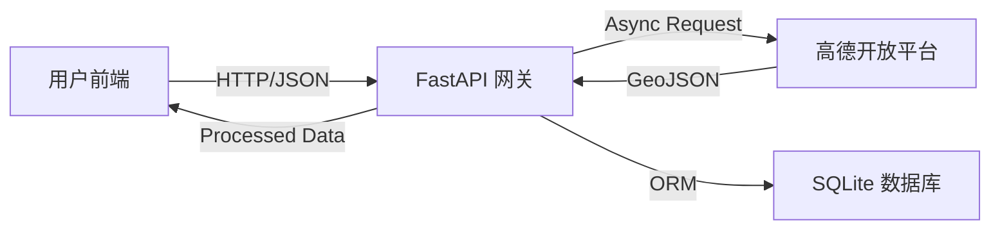

# 🚛 SmartRoute: 大型货车智能选线与通行资质预审系统
**SmartRoute: Intelligent Routing & Qualification Pre-check System for Heavy Trucks**

> **版本**: v1.2.1 | **日期**: 2026-01-23 | **状态**: 已部署/测试阶段

---

## 1. 概述 (Executive Summary)

### 1.1 项目背景与痛点
在大型货物运输行业，“路”与“车”的匹配是核心难题。与普通乘用车不同，大型货车面临着极高的试错成本：
-   **经济成本高敏感**: 一次错误的路线规划可能导致数百元的额外过路费或油费支出。
-   **政策限制复杂**: 各地对轴重、车高、排放标准的限制不一，传统导航往往缺乏针对大件运输的合规性检查。
-   **信息孤岛**: 运输企业的车辆数据（如轴距、核载）与导航软件的路线数据割裂，导致调度员需要在多个系统间切换，效率低下。

### 1.2 核心价值主张
**SmartRoute** 致力于打造一个垂直领域的“货运数字驾驶舱”，通过技术手段解决上述痛点：
1.  **全成本透明化 (TCO Optimization)**: 打破单一的“最短路径”推荐逻辑，综合计算**实时路费**与**燃油消耗**，为司机提供最具性价比的路线方案。
2.  **合规性前置 (Compliance First)**: 将“通行资质预审”前置到路线规划阶段，通过建立高精度的车辆数字档案，为后续的自动审批打下基础。
3.  **安全主动防御 (Active Safety)**: 针对货运行业高发的夜间疲劳驾驶事故，系统内置时空分析算法，主动识别高危时段与路段。

### 1.3 典型应用场景
-   **场景一：物流车队精细化运营**
    调度员在后台录入车队所有车辆的详细参数（长宽高、轴重），系统根据车辆特性自动推荐合规路线，并导出成本分析报告供财务审批。
-   **场景二：个体司机快速报价**
    司机在接单前，输入起终点，系统迅速算出“最低路费”与“最快路线”的成本差异（例如：多走50公里国道能省200元路费，但多耗油100元，净省100元），辅助司机精准报价。

---

## 2. 系统架构 (System Architecture)

本项目采用 **前后端分离 (SPA)** 架构，旨在构建一个高内聚、低耦合的现代化 Web 应用。

### 2.1 技术栈选型深度解析

| 层级 | 技术组件 | 核心优势与选型理由 |
| :--- | :--- | :--- |
| **前端** | **Vue 3 (Composition API)** | 相比 Options API，组合式 API 能更好地组织复杂的表单逻辑（如资质录入的分步校验），提升代码复用率。 |
| | **Quasar Framework** | 提供了开箱即用的高性能组件（如无限滚动列表、分步器），且遵循 Material Design 规范，确保了 B 端产品的交互一致性。 |
| | **Vite** | 基于 ESM 的极速构建工具，解决了传统 Webpack 在大型项目中冷启动慢的问题，开发体验极佳。 |
| | **AMap JS API 2.0** | 提供了 WebGL 渲染能力，在处理长途路线（数千个坐标点）的绘制时，性能远超 SVG/Canvas 方案。 |
| **后端** | **FastAPI** | 基于 Starlette 和 Pydantic，是目前 Python 生态中处理 I/O 密集型任务（如并发请求第三方 API）的性能天花板。 |
| | **Asyncio** | 利用协程实现非阻塞 I/O，使得后端能在 1 秒内完成对高德地图三个不同策略接口的并发调用与数据聚合。 |
| | **SQLAlchemy 2.0** | 采用现代化的 ORM 风格，支持异步数据库驱动，完美契合 FastAPI 的异步特性。 |

### 2.2 数据流向设计


---

## 3. 核心功能与实现细节 (Core Features & Implementation)

### 3.1 🗺️ 智能路线规划引擎 (Intelligent Routing Engine)

#### 3.1.1 多策略并发计算模型
传统的串行请求模式会导致用户等待时间过长（3-5秒）。SmartRoute 利用 Python 的 `asyncio.gather` 特性，实现了并行请求：
-   **速度优先 (Strategy 0)**: 优先选择高速公路，适合时效性要求高的冷链/快递运输。
-   **费用优先 (Strategy 1)**: 优先选择国道/省道，避开收费站，适合大宗物资/煤炭运输。
-   **距离优先 (Strategy 2)**: 最短路径算法，适合短途配送。

系统后端同时发起这三个请求，等待所有结果返回后，进行统一的数据清洗和格式化，最终将 **Top N** 方案一次性推送给前端。

#### 3.1.2 精准成本估算 (TCO Calculation)
系统内置了一个可配置的成本计算模型，不仅仅显示路费，还结合了车辆油耗模型：

> **总成本 = 路费 (Toll) + 油费 (Fuel)**

-   **路费**: 直接获取自高德 API 的 `tolls` 字段，该数据实时更新，包含分时段计费规则。
-   **油费**: 
    -   **基础油耗**: `距离(km) × 0.35L/km × 7.8元/L` (基于满载 49吨 牵引车模型)。
    -   **拥堵损耗**: `红绿灯数量 × 0.3L × 7.8元/L` (模拟启停带来的额外油耗)。
    
*注：此模型参数在后端 `routes.py` 中定义，未来可支持根据车型动态调整。*

#### 3.1.3 智能去重与路书生成 (NLP-based Deduplication)
原始导航数据往往包含冗余信息，例如：“沿G25长深高速行驶，途径G25长深高速，到达...”。
我们开发了一套基于规则的文本清洗算法：
1.  **去前缀**: 移除“沿”、“途径”等无实际地理意义的连接词。
2.  **合并同类项**: 当连续多个节点属于同一条道路（如 G25）时，仅保留入口和出口节点。
3.  **层级提取**: 优先保留“互通”、“枢纽”、“收费站”等关键决策点，过滤掉普通的“道路直行”指令。

**效果对比**:
-   *优化前*: 沿G1517莆炎高速 -> G1517莆炎高速 -> 三明西互通 -> 三明东互通
-   *优化后*: **G1517莆炎高速 -> 三明西互通 -> 三明东互通** (更加简洁清晰)

### 3.2 🛡️ 通行资质预审模块 (Qualification Pre-check)

该模块是实现“车路协同”的基础，通过数字化手段管理车辆资质。

#### 3.2.1 结构化数据建模
为了适应复杂的审批需求，我们设计了深度嵌套的数据结构：
-   **轴组信息**: 使用 JSON 数组存储每根轴的载重（如 `[10, 10, 12, 12]` 吨），这是判断桥梁承载能力的关键数据。
-   **外廓尺寸**: 精确记录长、宽、高（毫米级），用于后续与地图数据的“限高限宽”数据进行碰撞检测。

#### 3.2.2 交互式数据录入 (UX Design)
-   **分步引导**: 将复杂的 30+ 项信息拆分为“车辆信息”、“货物信息”、“运输计划”三个步骤，降低用户心理负担。
-   **智能纠错**: 
    -   当用户输入的轴数与轴距数据不匹配时，前端会实时报错。
    -   自动处理用户从 Excel 粘贴过来的不规范标点符号。

### 3.3 ⚠️ 主动安全防御体系 (Active Safety)

#### 3.3.1 夜间行车智能预警
系统会根据用户输入的“预计出发时间”和路线计算出的“行驶时长”，推演整个行程的时间轴。
-   **算法逻辑**: 若行程时间轴与 **凌晨 02:00 - 05:00** (国家规定的强制休息时段) 存在交集，系统会在路线卡片上打上高亮的 `夜间行车` 标签。
-   **价值**: 提醒调度员合理安排双驾驶员，或调整出发时间。

#### 3.3.2 隧道群风险提示
针对山区高速隧道密集的情况，系统会遍历路线的所有 Segment，统计包含“隧道”关键字的路段长度。
-   **展示**: 在路线详情中通过徽标展示“长隧道”或“隧道群”标识，辅助危化品车辆规避禁行路段。

---

## 4. 关键代码解析 (Code Deep Dive)

### 4.1 后端：异步并发选线 (Python Asyncio)
```python
# file: backend/app/api/routes.py

@router.post("/plan", response_model=RoutePlanResponse)
async def plan_route(request: RoutePlanRequest):
    """
    核心选线接口：同时发起多个策略请求，极大缩短响应时间。
    """
    # 1. 定义并发任务列表
    tasks = [
        # 策略 0: 速度优先 (常规最快)
        AmapService.get_route(request.origin, request.destination, strategy=0),
        # 策略 1: 费用优先 (避开收费)
        AmapService.get_route(request.origin, request.destination, strategy=1),
        # 策略 2: 距离优先 (路程最短)
        AmapService.get_route(request.origin, request.destination, strategy=2)
    ]
    
    # 2. 执行并发请求，return_exceptions=True 确保单个策略失败不影响整体
    results = await asyncio.gather(*tasks, return_exceptions=True)
    
    # 3. 结果聚合与去重 (逻辑略)
    final_routes = process_results(results, limit=request.route_count)
    return final_routes
```

### 4.2 前端：海量数据渲染优化 (Performance)
```javascript
// file: frontend/src/components/MapContainer.vue

function drawRoute(path) {
    /**
     * 性能优化：动态路段合并
     * 问题：长途路线包含 5000+ 个坐标点，直接渲染 Polyline 会导致 DOM 节点过多，浏览器卡顿。
     * 方案：将连续且交通状态相同（如都是“畅通”）的路段合并为一个对象。
     */
    const polylines = [];
    let currentPath = [path[0]];
    let currentStatus = path[0].status; // 0:未知, 1:畅通, 2:缓行, 3:拥堵

    for (let i = 1; i < path.length; i++) {
        if (path[i].status === currentStatus) {
            // 状态未变，仅追加坐标点，不创建新对象
            currentPath.push(path[i]); 
        } else {
            // 状态改变，渲染上一段，并开始新的一段
            polylines.push(createPolyline(currentPath, currentStatus));
            currentPath = [path[i]];
            currentStatus = path[i].status;
        }
    }
    // 效果：DOM 对象数量减少 90% 以上，且保留了路况颜色显示。
    map.add(polylines);
}
```

---

## 5. 部署与运维指南 (Deployment & Ops)

### 5.1 环境依赖
-   **Python**: 3.10+ (需支持 asyncio 新特性)
-   **Node.js**: 16+ (适配 Vite 构建)
-   **数据库**: SQLite (无需安装守护进程，文件级数据库)

### 5.2 关键环境变量配置 (.env)

| 变量名 | 作用域 | 说明 | 示例值 |
| :--- | :--- | :--- | :--- |
| `AMAP_API_KEY` | 后端 | 用于调用路径规划 Web 服务 API | `5bfa...` |
| `VITE_AMAP_KEY` | 前端 | 用于加载 JS 地图 SDK | `0625...` |
| `VITE_AMAP_SECURITY_CODE` | 前端 | JS API 的安全密钥，必填 | `cef9...` |
| `VITE_ENABLE_DATA_EXPORT` | 前端 | 功能开关：是否显示“导出JSON”按钮 | `true` |

### 5.3 启动流程
1.  **启动后端 API 服务**:
    ```bash
    cd backend
    uvicorn app.main:app --reload --host 0.0.0.0 --port 9876
    ```
    *此时访问 `http://localhost:9876/docs` 可查看自动生成的 Swagger API 文档。*

2.  **启动前端开发服务器**:
    ```bash
    cd frontend
    npm run dev
    ```
    *访问 `http://localhost:6789` 进入系统主页。*

---

## 6. 常见问题排查 (Troubleshooting)

-   **Q: 为什么地图能显示，但路径规划报错 `USERKEY_PLAT_NOMATCH`？**
    -   **A**: 高德地图的 Key 分为“Web端(JS API)”和“Web服务”两种类型。前端必须使用前者，后端必须使用后者。请检查 `.env` 文件是否混用了 Key。

-   **Q: 为什么长途路线显示“距离太长无法规划”？**
    -   **A**: 高德普通 API 对单次规划距离有限制（通常 < 3000km）。建议在起终点之间添加“途经点”来分段规划，SmartRoute 系统已支持最多 16 个途经点。

-   **Q: 导出的 JSON 数据乱码？**
    -   **A**: 系统默认使用 UTF-8 编码导出。如果使用 Excel 打开乱码，请先打开 Excel -> 数据 -> 导入数据 -> 选择 UTF-8 编码。

---

## 7. 总结与未来展望 (Roadmap)

SmartRoute 目前已完成 **Stage 1 (基础选线与合规)** 的开发目标。
-   **当前能力**: 实现了“算得准”（成本估算）、“跑得通”（多策略选线）、“管得住”（资质录入）。
-   **未来规划 (Stage 2)**:
    -   **AI 赋能**: 集成 Ollama 本地大模型，实现对行驶证、道路运输证图片的 OCR 识别与自动填单。
    -   **移动端适配**: 开发微信小程序版本，方便司机随时随地查看路线与申报状态。
    -   **桥梁验算**: 引入桥梁结构数据，结合车辆轴重信息，实现真正的“大件运输通行性验算”。

---
*本文档由 SmartRoute 架构组维护，旨在为开发人员、运维人员及项目干系人提供全方位的技术指引。*
