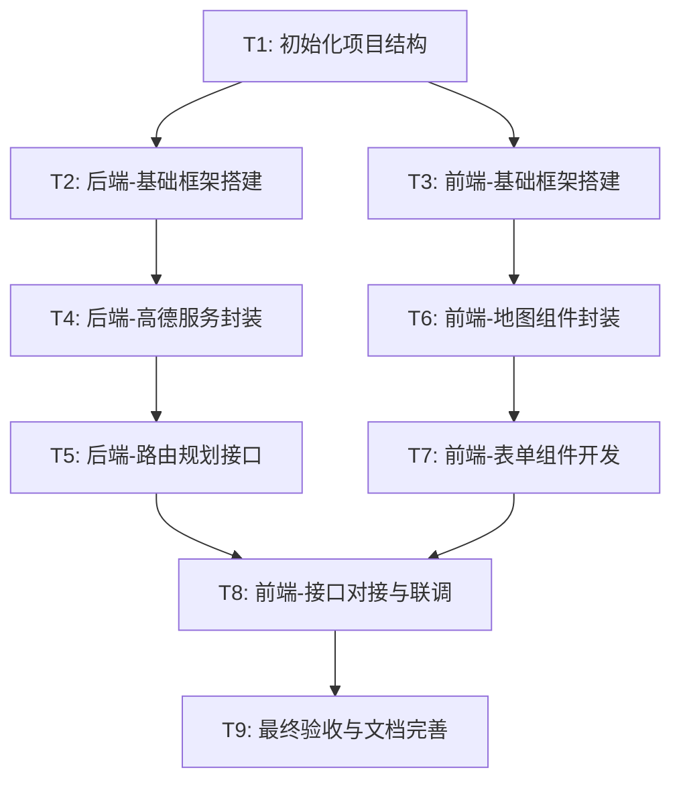

# 任务分解文档：大型货车智能选线系统

## 1. 任务依赖图

## 2. 原子任务清单

### T1: 初始化项目结构
- **输入**: DESIGN文档
- **操作**:
    - 创建 `SmartRoute` 根目录。
    - 创建 `backend` 和 `frontend` 子目录。
    - 创建 `.env.example` 和 `.gitignore`。
- **验收**: 目录结构与设计文档一致。

### T2: 后端-基础框架搭建
- **输入**: Python环境
- **操作**:
    - 初始化 FastAPI 项目 (`main.py`, `requirements.txt`)。
    - 配置 CORS。
    - 编写简单的 `/health` 接口。
- **验收**: `uvicorn` 启动服务，访问 `/health` 返回 200。

### T3: 前端-基础框架搭建
- **输入**: Node.js环境
- **操作**:
    - 使用 Quasar CLI 初始化项目 (`npm init quasar`)。
    - 配置基础布局 (Layout)。
- **验收**: `npm run dev` 启动服务，浏览器能看到 Quasar 默认页面。

### T4: 后端-高德服务封装
- **输入**: 高德API Key, `amap_utils.py` (参考)
- **操作**:
    - 创建 `services/amap_service.py`。
    - 实现 `geo_code` (地址转坐标)。
    - 实现 `plan_route` (路径规划请求)。
    - 仅保留选线核心逻辑，剔除桥梁计算。
- **验收**: 单元测试能成功调用高德API并返回数据。

### T5: 后端-路由规划接口
- **输入**: T4完成
- **操作**:
    - 定义 Request/Response Schema。
    - 实现 `POST /api/v1/routes/plan`。
    - 集成 `amap_service`。
- **验收**: Swagger UI (`/docs`) 中能发送请求并获得标准 JSON 响应。

### T6: 前端-地图组件封装
- **输入**: T3完成
- **操作**:
    - 引入 `@amap/amap-jsapi-loader`。
    - 创建 `MapContainer.vue`。
    - 实现地图初始化和销毁。
- **验收**: 页面能显示高德地图，不报错。

### T7: 前端-表单组件开发
- **输入**: T3完成
- **操作**:
    - 创建 `RouteForm.vue`。
    - 包含起点、终点输入框。
    - 包含车辆参数输入框（折叠面板或弹窗）。
- **验收**: 表单能输入数据，校验必填项。

### T8: 前端-接口对接与联调
- **输入**: T5, T6, T7完成
- **操作**:
    - 封装 Axios 请求。
    - 在表单提交时调用后端接口。
    - 将返回的路径数据在 `MapContainer` 中绘制 (Polyline)。
- **验收**: 输入起终点 -> 点击查询 -> 地图上显示路线轨迹。

### T9: 最终验收与文档完善
- **输入**: T8完成
- **操作**:
    - 全流程测试。
    - 更新 `README.md`。
    - 清理临时文件。
- **验收**: 系统运行稳定，文档完整。
